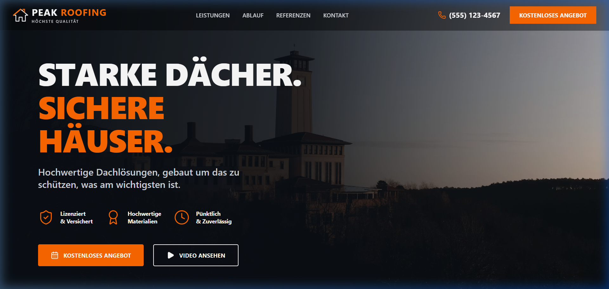

# Peak Roofing - Premium Roofing Solutions Landing Page

Peak Roofing is a premium, modern, and high-performance landing page for a roofing solutions provider. Featuring a sleek, dark-themed responsive design with eye-catching gradients, smooth layouts, and clear calls to action, it is designed to maximize conversion rates and user engagement.

## 📸 Preview



## ✨ Features

- **Stunning Dark-Themed Aesthetics**: Sleek background gradients, HSL colors, and a clean, high-end feel.
- **Fully Responsive Design**: Optimized for desktop, tablet, and mobile viewing.
- **Strong Calls-to-Action (CTAs)**: Primary "KOSTENLOSES ANGEBOT" (Free Quote) buttons and a secondary video-viewing prompt.
- **Highlighting Key Value Propositions**: Clean badges showcasing crucial business attributes (Licensed & Insured, Premium Materials, On-Time & Reliable).
- **Embedded SVG Logo**: Custom responsive branding element tailored for Peak Roofing.

## 🛠️ Technology Stack

- **Framework**: [React 19](https://react.dev/)
- **Build Tool**: [Vite](https://vite.dev/)
- **Styling**: [Tailwind CSS v4](https://tailwindcss.com/)
- **Icons**: [Lucide React](https://lucide.dev/)
- **Animations**: [Motion](https://motion.dev/)

## 🚀 Getting Started

Follow these steps to run the application locally on your machine.

### Prerequisites

Make sure you have [Node.js](https://nodejs.org/) installed.

### Installation & Run

1. Clone this repository to your local machine.
2. Install the dependencies:
   ```bash
   npm install
   ```
3. Start the local development server:
   ```bash
   npm run dev
   ```
4. Open your browser and navigate to `http://localhost:3000/`.
